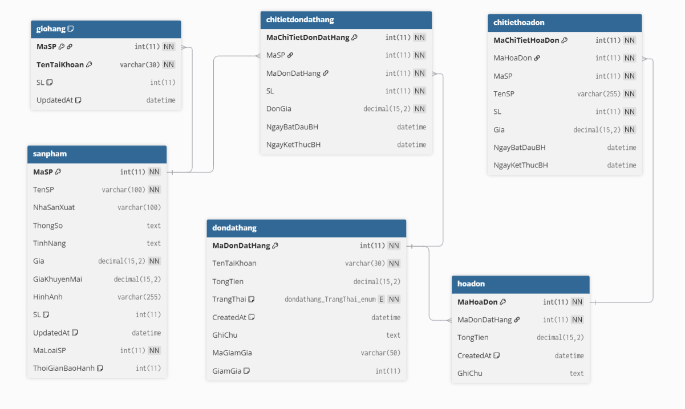
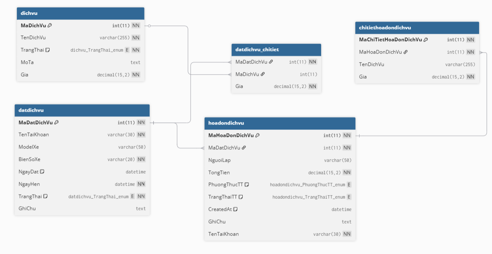
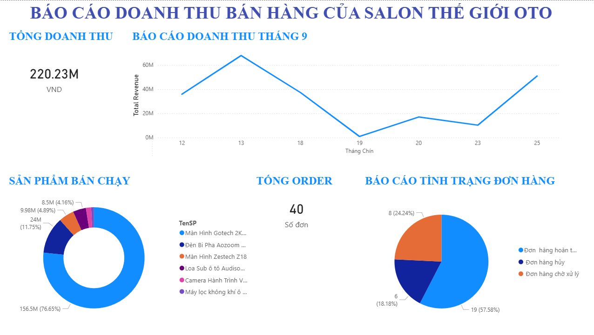

# 📊 Phân Tích Dữ Liệu Bán Hàng (SQL + Power BI)

## 📌 Tổng quan

Dự án này tập trung vào việc phân tích dữ liệu bán hàng nhằm hiểu rõ hiệu suất doanh thu, xu hướng sản phẩm và hành vi đơn hàng.

Dữ liệu được xử lý bằng SQL và trực quan hóa bằng Power BI để xây dựng dashboard tương tác hỗ trợ ra quyết định.

---

## 🗂️ Phát triển SQL

### 🔹 Thiết kế cơ sở dữ liệu

Thiết kế và xây dựng các bảng dữ liệu quan hệ, bao gồm:

* Sản phẩm
* Đơn hàng
* Chi tiết đơn hàng
* Dịch vụ
* Kho (Nhập/Xuất)

---

## 🗂️ Sơ đồ cơ sở dữ liệu

### 🔹 ERD Bán hàng

  

### 🔹 ERD Dịch vụ

  

---

### 🔹 Thêm dữ liệu

* Thêm dữ liệu mẫu để mô phỏng hoạt động kinh doanh thực tế
* Bao gồm dữ liệu giao dịch bán hàng và đơn hàng

---

### 🔹 Xử lý & phân tích dữ liệu

* Kết hợp nhiều bảng (JOIN) để tạo bộ dữ liệu phân tích
* Tính toán tổng doanh thu
* Tổng hợp hiệu suất sản phẩm (số lượng, doanh thu)
* Phân tích trạng thái đơn hàng (Hoàn thành, Hủy, Đang xử lý)
* Chuẩn bị dữ liệu cho việc trực quan hóa trên Power BI

---

## 📊 Power BI – Dashboard Bán hàng

Dashboard tập trung vào **phân tích doanh thu và hiệu suất bán hàng**:

### 🔹 Tổng quan doanh thu

* Tổng doanh thu
* Xu hướng doanh thu theo thời gian

### 🔹 Hiệu suất sản phẩm

* Sản phẩm bán chạy
* Tỷ trọng doanh thu theo sản phẩm

### 🔹 Phân tích đơn hàng

* Tỷ lệ trạng thái đơn hàng
* So sánh đơn hoàn thành và đơn bị hủy

---

## 📈 Insight chính

* Một số ít sản phẩm đóng góp phần lớn doanh thu
* Có sản phẩm bán nhiều nhưng đóng góp doanh thu thấp
* Đơn hàng bị hủy chiếm một tỷ lệ đáng kể
* Doanh thu biến động theo thời gian (có thể có yếu tố mùa vụ)

---

## 🛠️ Công cụ sử dụng

* SQL (xử lý và phân tích dữ liệu)
* Power BI (trực quan hóa và dashboard)

---

## 📸 Dashboard

  

---

## 👨‍💻 Tác giả

**Vu Minh Hieu**
